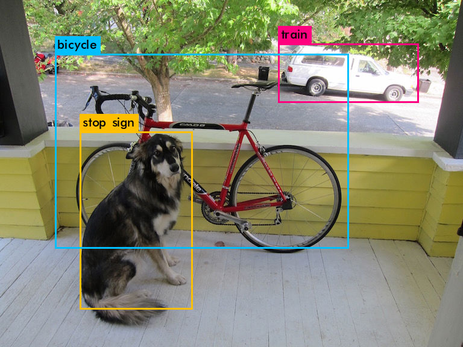

# Installation of NVIDIA as GPGPU  

### Prepare  
Centos7.5  
cuda_10.0.130_410.48_linux.run  
cudnn-10.0-linux-x64-v7.5.0.56.tgz  

### Check NVIDIA GPU on machine.  
```
$ lspci | grep -i nvidia
01:00.0 VGA compatible controller: NVIDIA Corporation GP107 [GeForce GTX 1050 Ti] (rev a1)
01:00.1 Audio device: NVIDIA Corporation GP107GL High Definition Audio Controller (rev a1)
```
**GTX1050Ti** here!  

### Disable noubeau  

On graphical mode,  
```
  # vi /etc/modprobe.d/blacklist-nouveau.conf
  # ln blacklist-nouveau.conf nouveau-blacklist.conf

    blacklist nouveau
    options nouveau modeset=0

  # dracut --force

  # systemctl set-default multi-user.target
  # reboot
```
Into CLI login mode.  

### Runfile Installer  
```
  # sh cuda_10.0.130_410.48_linux.run --silent
```
After a few minites, return to prompting.  

### Setup xconfig
```
  # nvidia-xconfig
  $ ls /etc/X11/
    Xmodmap  Xresources  applnk  fontpath.d  xinit  xorg.conf  xorg.conf.backup  xorg.conf.d  xorg.conf.nvidia-xconfig-original

  # systemctl set-default graphical.target
  # reboot
```
Into graphical login mode.  

### Install cuDNN  

```
  # cd /usr/local
  # tar xzf cudnn-10.0-linux-x64-v7.5.0.56.tgz
  $ ls /usr/local/cuda/lib64/*cudnn*
    /usr/local/cuda/lib64/libcudnn.so    /usr/local/cuda/lib64/libcudnn.so.7.5.0
    /usr/local/cuda/lib64/libcudnn.so.7  /usr/local/cuda/lib64/libcudnn_static.a

```

### Check installations of CUDA and cuDNN using darknet
```
  $ git clone https://github.com/pjreddie/darknet
  $ cd darknet
  $ vi Makefile
    GPU   = 1
    CUDNN = 1
  $ make -j4
  $ objdump -p darknet | grep lib
  NEEDED               libm.so.6
  NEEDED               libcuda.so.1
  NEEDED               libcudart.so.10.0
  NEEDED               libcublas.so.10.0
  NEEDED               libcurand.so.10.0
  NEEDED               libcudnn.so.7
  NEEDED               libstdc++.so.6
  NEEDED               libpthread.so.0
  NEEDED               libc.so.6
```

```
  $ vi example/darknet
    cfg/voc.data
  $ make -j4
  $ wget https://pjreddie.com/media/files/yolov2-voc.weights
  $ ./darknet detect cfg/yolov2-voc.cfg yolov2-voc.weights data/dog.jpg
```
Check GPU usage with nvidia-smi command.
```
+-----------------------------------------------------------------------------+
| NVIDIA-SMI 410.48                 Driver Version: 410.48                    |
|-------------------------------+----------------------+----------------------+
| GPU  Name        Persistence-M| Bus-Id        Disp.A | Volatile Uncorr. ECC |
| Fan  Temp  Perf  Pwr:Usage/Cap|         Memory-Usage | GPU-Util  Compute M. |
|===============================+======================+======================|
|   0  GeForce GTX 105...  Off  | 00000000:01:00.0  On |                  N/A |
| 50%   58C    P0    N/A /  75W |   1271MiB /  4039MiB |     81%      Default |
+-------------------------------+----------------------+----------------------+
                                                                               
+-----------------------------------------------------------------------------+
| Processes:                                                       GPU Memory |
|  GPU       PID   Type   Process name                             Usage      |
|=============================================================================|
|    0      1534      C   ./darknet                                    977MiB |
|    0      1653      G   /usr/bin/X                                   118MiB |
|    0      2485      G   /usr/bin/gnome-shell                         116MiB |
|    0     14812      G   ...equest-channel-token=555406408480941287    55MiB |
+-----------------------------------------------------------------------------+
```

  

Predict yolov2 on GPU with UVC Camera.  
```
  $ pip install opencv-devel
  $ vi Makefile
    OPENCV = 1
  $ make -j4
  $ ./darknet detector demo cfg/voc.data cfg/yolov2-voc.cfg yolov2-voc.weights
  FPS:23.7
```

**May.04, 2019**  
