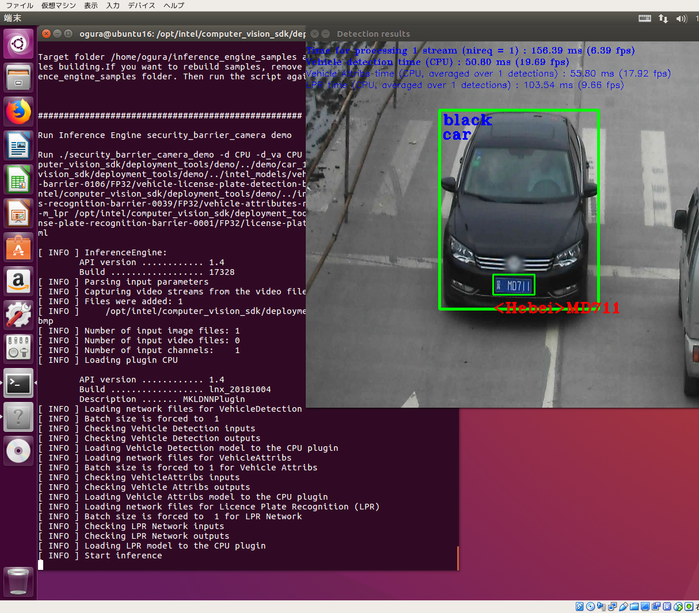
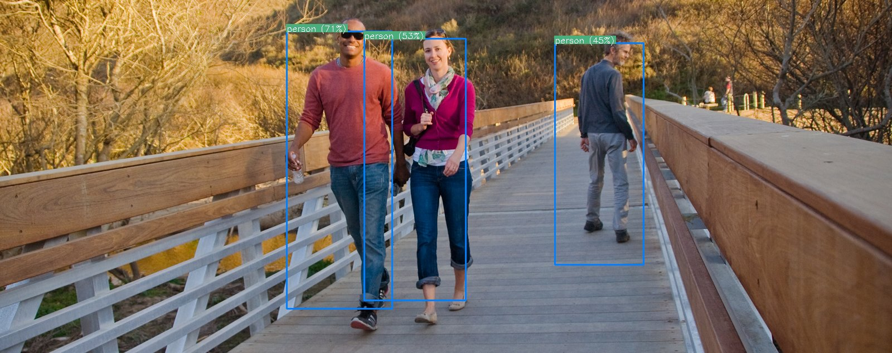
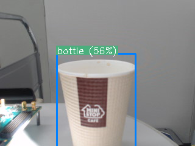

# OpenVINO for Movidius NCS-1 and NCS-2(2nd generation stick)


[github for NCS(1st generation)](https://github.com/movidius/ncsdk) is completed. And NCS-2(2nd generation) is supported by OpenVINO. OpenVINO support not only NCS 1 and 2 but also CPU, GPU and FPGA(Altera Arria10 GX).  

[OpenVINO do not support RaspnerryPi](https://ncsforum.movidius.com/discussion/1302/intel-neural-compute-stick-2-information#latest)  

This is story of estimation of combination btn movidius NCS and OpenVINO.  

## Requirement

- Ubuntu16.04 on intelPC
- Nueral Compute Stick(1st generation), maybe ok with NCS-2(2nd generation)
- OpenVINO 2018.4.420(releases_openvino-2018-r4)

## Download and installation

After registration we can get OpenVINO from [here](https://software.intel.com/en-us/openvino-toolkit).  

According to [here(Install the Intel® Distribution of OpenVINO™ toolkit for Linux)](https://software.intel.com/en-us/articles/OpenVINO-Install-Linux), we can do from install to check by running DEMO(inference car.png) on CPU processing(We employed caffe optimizer installation only).  

**After Download l_openvino_toolkit_p_<version>.tgz,**
```
$ tar xzf l_openvino_toolkit_p_<version>.tgz
$ cd l_openvino_toolkit_p_<version>
# ./install_cv_sdk_dependencies.sh
# ./install_GUI.sh
$ . /opt/intel/computer_vision_sdk/bin/setupvars.sh ## add your .bashrc
```
**Setup Caffe and Tensorflow Model Optimizer**  
```
$ cd /opt/intel/computer_vision_sdk/deployment_tools/model_optimizer/install_prerequistes
$ ./install_prerequisites_caffe.sh
$ ./install_prerequisites_tf.sh
```
If you need more Framework, run bellow,  
```
install_prerequisites_<FW>.sh, FW is such as mxnet, onnx, kaldi.  
```

**1st DEMO result is bellow,**  

**Notice!:** Demo sample script create directory ~/openvino and download .prototxt and .caffemodel in it. So notice permission of directory.  

```
$ cd /opt/intel/computer_vision_sdk/deployment_tools/model_optimizer/install_prerequisites/
# ./install_prerequisites.sh
$ cd /opt/intel/computer_vision_sdk/deployment_tools/demo
$ ./demo_squeezenet_download_convert_run.sh
```


In my first impression, download and installation of OpenVINO is very easy!, great.  

**2nd DEMO result is bellow,**

1pipe : recognize car region box  
2pipe : recognize licence plate region box  
3pipe : recognize charactors on licence plate  

```
$ cd ~/intel/computer_vision_sdk/deployment_tools/demo
$ ./demo_security_barrier_camera.sh
```



Our DEMO-environment is on VirtualBox Ubuntu16.04 on Intel Celeron CPU.  
But it shows performance as 6.39fps for 1st pipe, 19.69fps for 2nd pipe, 9.55fps for 3rd pipe.  

## Using Movidius NCS-1

To run demo scripts on NCS-1, **add usbboot rule** and **add your user id into "users group"**, finally run demo scripts with **-d MYRIAD option**.

Setup udev rules for MYRIAD.  
Place [97-myriad-usbboot.rules](./etc/udev/rules.d/97-myriad-usbboot.rules) on /etc/udev/rules.d/

```
# usermod -a -G users "$(whoami)"
# cp 97-usbboot.rules /etc/udev/rules.d/
# udevadm control --reload-rules
# udevadm trigger
# ldconfig
# reboot
```

After Rebooting plugin NCS-1 on USB port.  

On the our way to install, we selected option for Movidius NCS-1 and NCS-2 support, so that we are ready to run NCS via OpenVINO as inference engin(called IE) **by adding -d MYRIAD** with sample script.  

```
$ cd /opt/intel/computer_vision_sdk/deployment_tools/demo
$ ./demo_squeezenet_download_convert_run.sh -d MYRIAD
$ ./demo_security_barrier_camera.sh -d MYRIAD
```
Check "[INFO] Loading LPR model to **the MYRIAD plugin**" log messages.  

## Additional demo for other models on NCS-1  

### SSD_MobileNet
- Download ncappzoo from [here](https://github.com/k5iogura/ncappzoo)  
- Run model optimizer with .caffemodel and .prototxt for SSD_MobileNet  
- Run DEMO script

#### model conversion caffe to ir(OpenVINO intermidiate representation)  
For OpenVINO generate intermidiate representation as .bin and .xml.  
Here .bin file includes weights of model and .xml file includes network structure.  
OpenVINO Model Optimizer help is bellow,  
```
$ /opt/intel/computer_vision_sdk/deployment_tools/model_optimizer/mo_caffe.py --help
usage: mo_caffe.py [-h] [--input_model INPUT_MODEL] [--model_name MODEL_NAME]
                   [--output_dir OUTPUT_DIR] [--input_shape INPUT_SHAPE]
                   [--scale SCALE] [--reverse_input_channels]
                   [--log_level {CRITICAL,ERROR,WARN,WARNING,INFO,DEBUG,NOTSET}]
                   [--input INPUT] [--output OUTPUT]
                   [--mean_values MEAN_VALUES] [--scale_values SCALE_VALUES]
                   [--data_type {FP16,FP32,half,float}] [--disable_fusing]
                   [--disable_resnet_optimization]
                   [--finegrain_fusing FINEGRAIN_FUSING] [--disable_gfusing]
                   [--move_to_preprocess] [--extensions EXTENSIONS]
                   [--batch BATCH] [--version] [--silent]
                   [--freeze_placeholder_with_value FREEZE_PLACEHOLDER_WITH_VALUE]
                   [--generate_deprecated_IR_V2] [--input_proto INPUT_PROTO]
                   [-k K] [--mean_file MEAN_FILE]
                   [--mean_file_offsets MEAN_FILE_OFFSETS]
                   [--disable_omitting_optional]
                   [--enable_flattening_nested_params]
```

For Movidius use data_type with FP16 only.  
command line may be bellow,
```
$ export MO=/opt/intel/computer_vision_sdk/deployment_tools/model_optimizer/
$ cd ~/openvino_fs/models/SSD_Mobilenet/caffe
$ python $MO/mo_caffe.py --input_model MobileNetSSD_deploy.caffemodel --output_dir ../FP16/ --data_type FP16
Model Optimizer arguments:
Common parameters:
	- Path to the Input Model: 	~/openvino_fs/models/SSD_Mobilenet/caffe/MobileNetSSD_deploy.caffemodel
	- Path for generated IR: 	~/openvino_fs/models/SSD_Mobilenet/caffe/../FP16/
	- IR output name: 	MobileNetSSD_deploy
	- Log level: 	ERROR
	- Batch: 	Not specified, inherited from the model
	- Input layers: 	Not specified, inherited from the model
	- Output layers: 	Not specified, inherited from the model
	- Input shapes: 	Not specified, inherited from the model
	- Mean values:  	Not specified	
	- Scale values: 	Not specified
	- Scale factor: 	Not specified
	- Precision of IR: 	FP16
	- Enable fusing: 	True
	- Enable grouped convolutions fusing: 	True
	- Move mean values to preprocess section: 	False
	- Reverse input channels: 	False
Caffe specific parameters:
	- Enable resnet optimization: 	True
	- Path to the Input prototxt: 	~/openvino_fs/models/SSD_Mobilenet/caffe/MobileNetSSD_deploy.prototxt
	- Path to CustomLayersMapping.xml: 	Default
	- Path to a mean file:  	Not specified
	- Offsets for a mean file: 	Not specified
Model Optimizer version: 	        1.4.292.6ef7232d

[ SUCCESS ] Generated IR model.
[ SUCCESS ] XML file: ~/openvino_fs/models/SSD_Mobilenet/caffe/../FP16/MobileNetSSD_deploy.xml
[ SUCCESS ] BIN file: ~/openvino_fs/models/SSD_Mobilenet/caffe/../FP16/MobileNetSSD_deploy.bin
[ SUCCESS ] Total execution time: 2.85 seconds. 

$ ls ../FP16
MobileNetSSD_deploy.bin  MobileNetSSD_deploy.mapping  MobileNetSSD_deploy.xml  
```

#### DetectionOutput Layer of OpenVINO

*DetectionOutput* layer in **models/SSD_Mobilenet/caffe/MobileNetSSD_deploy.prototxt** consists of bellow,

```
layer {
  name: "detection_out"
  type: "DetectionOutput"
  bottom: "mbox_loc"
  bottom: "mbox_conf_flatten"
  bottom: "mbox_priorbox"
  top: "detection_out"
  include {
    phase: TEST
  }
  detection_output_param {
    num_classes: 21
    share_location: true
    background_label_id: 0
    nms_param {
      nms_threshold: 0.45
      top_k: 100
    }
    code_type: CENTER_SIZE
    keep_top_k: 100
    confidence_threshold: 0.25
  }
}
```

In OpenVINO Framework, above *DetectionOutput* layer outputs bellow numpy structure.  

**DetectionOutput layer output structure, numpy shape is (1,1,100,7)**

|Valid|class-id|conf|x1|y1|x2|y2|
|   -:|      -:|  -:|-:|-:|-:|-:|
|    0|class-id|conf|x1|y1|x2|y2|
|    0|     ...| ...|..|..|..|..|
|    0|class-id|conf|x1|y1|x2|y2|
|   -1|       0|   0| 0| 0| 0| 0|
|    0|     ...| ...|..|..|..|..|
|    0|       0|   0| 0| 0| 0| 0|

100 lines and 7 items a line are outputed.  
Valid is 0 or -1 here 0 is valid and -1 is invalid beyond lines.  
Analyze above structure and use result of inference with your custom way.  

#### Try to infer sample images with SSD_Mobilenet model as text output  
Simple script named "ssd_mobilenet.py" infer 3 images and output results as text.  

```
$ cd ~/openvino_fs/ie/SSD_Mobilenet/
$ ls
images/  ssd_mobilenet.py demo_ssd_mobilenet.py demo_uvc_ssd_mobilenet.py

// result as text printout
$ python3 ssd_mobilenet.py images/*
n/c/h/w (from xml)= 1 3 300 300
input_blob : out_blob = data : detection_out
input image = images/DAR_Facts_17.jpg
in-frame (1, 3, 300, 300)
fin (1, 1, 100, 7)
top
[0.          6.           1.          0.5126953   0.20935059  0.9482422  0.70410156]
[0.          7.           0.29614258  0.43115234  0.39086914  0.49072266 0.49487305]
[ 0.         15.          0.4152832   0.34228516  0.41918945  0.38720703 0.625     ]
[ 0.         15.          0.26489258  0.25732422  0.41308594  0.3178711  0.79785156]
input image = images/Gene-Murtagh-Kingspan-670x310.jpg
in-frame (1, 3, 300, 300)
fin (1, 1, 100, 7)
top
[ 0.         15.          0.9980469   0.10913086  0.0234375   0.86035156  0.9892578 ]
input image = images/car.jpg
in-frame (1, 3, 300, 300)
fin (1, 1, 100, 7)
top
[0.         7.         1.         0.10473633 0.38916016 0.8925781 0.91552734]
input image = images/pedestiran-bridge.jpg
in-frame (1, 3, 300, 300)
fin (1, 1, 100, 7)
top
[ 0.         15.          0.7158203   0.32128906  0.08862305  0.43945312  0.87402344]
[ 0.         15.          0.5390625   0.4086914   0.11035156  0.52197266  0.8515625 ]
[ 0.         15.          0.45532227  0.6220703   0.12280273  0.7216797   0.75      ]
```
each line means that "N/A  class  x1  y1  x2  y2" and here classes are as VOC bellow,  
0: background  
1: aeroplane  
2: bicycle  
3: bird  
4: boat  
5: bottle  
6: bus  
7: car  
8: cat  
9: chair  
10: cow  
11: diningtable  
12: dog  
13: horse  
14: motorbike  
15: person  
16: pottedplant  
17: sheep  
18: sofa  
19: train  
20: tvmonitor  

#### Drawing result of inference on inferred image
Next script named "demo_ssd_mobilenet.py" shows results of inferenced region boxes on image.  

```
$ python3 demo_ssd_mobilenet.py images/pedestiran-bridge.jpg
```

  

#### Using USB Camera as input of demo
Next scripts named "demo_uvc_ssd_mobilenet.py" provides real-time inference demonstration.  
Ubuntu16.04 supports UVC Camera by default kernel **via /dev/video0**.  

```
// check uvc camera device
$ ls /dev/video*
/dev/video0

// result in video window
$ python3 demo_uvc_ssd_mobilenet.py
```



My morning coffee!

## Also refer below web site,  
[Intel Neural Compute Stick Getting start](https://software.intel.com/en-us/neural-compute-stick/get-started)  
[AIを始めよう！PythonでOpenVINOの仕組みを理解する](https://qiita.com/ammo0613/items/ff7452f2c7fab36b2efc)  
