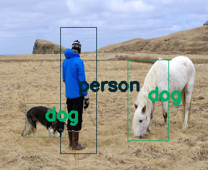

# TinyYOLOv2_352x288 for AI-Chips via Tensorflow

Can run yolov2-tiny with HW = 288x352 featuremap on some device such 
 as CPU, Myriad2.  
yolov2-tiny-352x288 model is faster than 416x416 model.  

  

## On CPU with Tensorflow  

- Install required packages  
  Tensorflow, tfdebugger, OpenVINO  
    
  Use pip3 for installation of tensorflow  
  Use apt for eog or feh  
  
- Prepare data  
    
  
```
  $ cat yolov2-tiny-voc_352_288_final.weights.* > yolov2-tiny-voc_352_288_final.weights
```

- Create y.pb by test.py  

```
  $ python3 test.py
```

- Using UVC Camera  
Connect UVC Camera via USB port.  
```
  $ python3 test_webcam.py
```

## On CPU with OpenVINO  

- Optimize y.pb for OpenVINO FP32 and FP16  

```
  $ export mo=/opt/intel/openvino/deployment_tools/model_optimizer/
  $ $mo/mo_tf.py --input_model y.pb \
    --output xoutput \
    --data_type FP16 \
    --output_dir FP16
```
  Issue mo_tf.py with both FP16 and FP32.  
  
- Run Demo with FP32 or FP16  

```
  $ python3 tinyyolov2_predict.py person.jpg -d CPU
  $ python3 tinyyolov2_predict.py person.jog -d MYRIAD
```

- Check result  

```
  $ eog person_result.png
  or
  $ feh person_result.png
```


Why two dogs!:smile:  

- Using UVC Camera  

```
  $ python3 tinyyolov2_demo_uvc.py -d CPU
  $ python3 tinyyolov2_demo_uvc.py -d MYRIAD
```

- Using CSI Camera on RaspberryPi  

Install OpenVINO on RaspberryPi according to bellow,  
Download l_openvino_toolkit_raspbi_p_2019.1.094.tgz from intel site and read  
  

```
 $  sudo mkdir -p /opt/intel/openvino
 $  sudo tar xzf l_openvino_toolkit_raspbi_p_2019.1.094.tgz --strip 1 -C /opt/intel/openvino/
 $  sudo sed -i "s|<INSTALLDIR>|/opt/intel/openvino|" /opt/intel/openvino/bin/setupvars.sh
 $  . /opt/intel/openvino/bin/setupvars.sh
 $  sudo apt install -y cmake
 $  sudo usermod -a -G users "$(whoami)"
 $  sh /opt/intel/openvino/install_dependencies/install_NCS_udev_rules.sh
```
Check OpenVINO with NCS  

```
 $  cd Downloads/
 $  mkdir build ; cd build/
 $  cmake -DCMAKE_BUILD_TYPE=Release -DCMAKE_CXX_FLAGS="-march=armv7-a" /opt/intel/openvino/deployment_tools/inference_engine/samples
 $  make -j2 object_detection_sample_ssd
 $  wget --no-check-certificate https://download.01.org/opencv/2019/open_model_zoo/R1/models_bin/face-detection-adas-0001/FP16/face-detection-adas-0001.bin
 $  wget --no-check-certificate https://download.01.org/opencv/2019/open_model_zoo/R1/models_bin/face-detection-adas-0001/FP16/face-detection-adas-0001.xml
 $  ./armv7l/Release/object_detection_sample_ssd -m face-detection-adas-0001.xml -d MYRIAD -i ~/vinosyp/files/pedestiran-bridge_result.jpg 
 $  eog out_0.bmp 
```

Run Demo script,  
```
  $ python3 tinyyolov2_demo_csi.py -d CPU
  $ python3 tinyyolov2_demo_csi.py -d MYRIAD
```

**Apr.26 2019**
